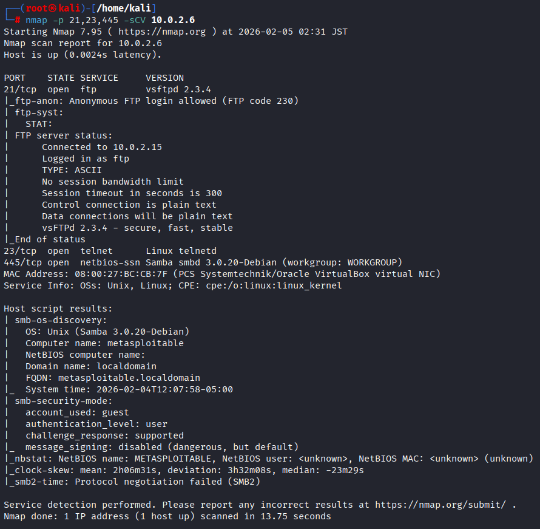

# Metasploitable 2 - Security Assessment 

## Información del objetivo

- **IP:** 10.0.2.6
- **Sistema Operativo:** Linux 2.6.9 - 2.6.33
- **Propósito:** Análisis de vulnerabilidades en entorno controlado


## Metodología
1. Reconocimiento y escaneo de red
2. Enumeración de servicios
3. Identificación de vulnerabilidades
4. Explotación
5. Documentación y remediaciones


## Reconocimiento inicial 

### Escaneo de puertos

Se realizó un escaneo para identificar todos los puertos abiertos:

```bash
nmap -p- 10.0.2.6
```


## Análisis de resultado
Se encontraron varios puertos conocidos por tener vulnerabilidades críticas **FTP (21)**, **TELNET (23)**, y **SAMBA (445**). Para verificar si son explotables, el siguiente paso es hacer un escaneo de **detección de servicios** para conocer que software específico está corriendo y si existen vulnerabilidades conocidas de dichas versiones.

```bash
nmap -p 21,23,445 -sCV 10.0.2.6
```



**PUERTO 21**
Por medio de **msfconsole** se consigue acceso root por medio de un exploit


