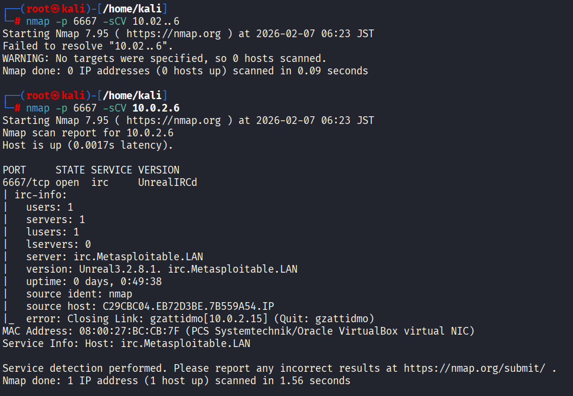
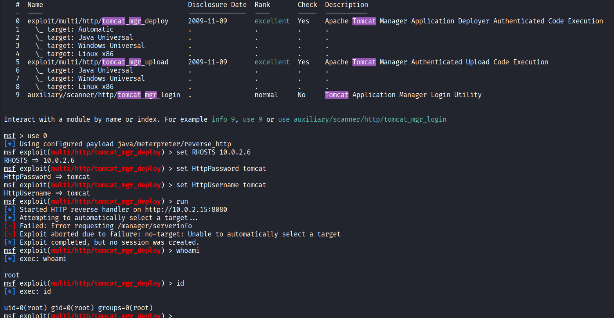
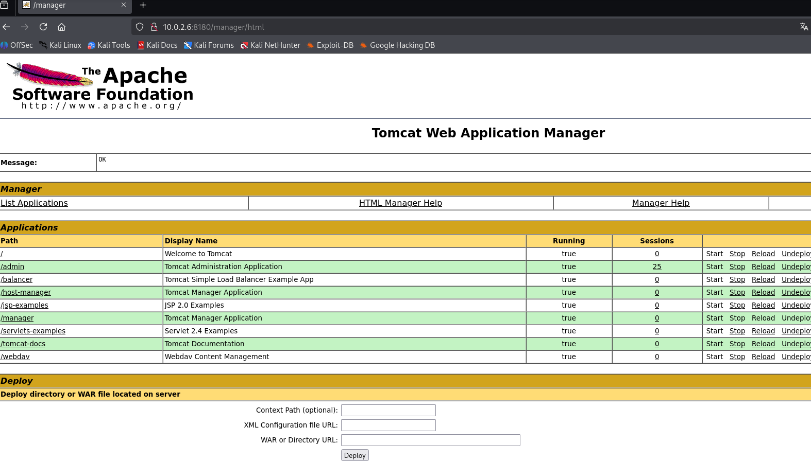

# Metasploitable 2 - Security Assessment 

## Información del objetivo

- **IP:** 10.0.2.6
- **Sistema Operativo:** Linux 2.6.9 - 2.6.33
- **Propósito:** Análisis de vulnerabilidades en entorno controlado


## Metodología
1. Reconocimiento y escaneo de red
2. Enumeración de servicios
3. Identificación de vulnerabilidades
4. Explotación
5. Documentación y remediaciones


## Reconocimiento inicial 

### Escaneo de puertos

Se realizó un escaneo para identificar todos los puertos abiertos:

```bash
nmap -p- 10.0.2.6
```


## Análisis de resultado
Se encontraron más de 15 puertos con servicios expuestos. Para verificar si son explotables, el siguiente paso es hacer un escaneo de **detección de servicios** para conocer que software específico está corriendo y si existen vulnerabilidades conocidas de dichas versiones.


### Puerto 21 - FTP (vsftpd 2.3.4)

```bash
nmap -p 21 -sCV
```


A partir del escaneo de versiones, se identificó un backdoor en este servicio.

* **Vulnerabilidad:** Backdoor Command Execution (CVE-2011-2523)
* **Módulo utilizado** `exploit/unix/ftp/vsftpd_234_backdoor`
* **Impacto:** Acceso a root al sistema.
* **Remediación:** Se recomienda actualizar el servidor FTP, o usar servicios más seguros como SFTP. Además, se debe restringir el acceso a el puerto 21 por medio de un Firewall si no es necesario.


> **Nota:** Como se observa en la captura, tras correr el exploit permitea acceso a root al sistema.


### Puerto 139 / 445 - NetBIOS / Samba

```bash
nmap -p 139,445 -sCV 10.0.2.6
```


* **Servicio:** Samba 3.0.20-Debian.
* **Módulo utilizado:** `multi/samba/usermap_script`
* **Vulnerabilidad:** usermap_script (Ejecución remota de comandos -RCE).
* **Análisis:** Se utiliza un módulo de Metasploit para explotar una deficiencia en el manejo de nombres de usuario, esto permite inyectar una shell en el servidor.
* **Impacto:** Crítico. Se obtiene una shell con privilegios de root de forma directa, permite control total del sistema.
* **Remediación:** Actualización de software a una superior, limitar los accesos al puerto 139 y 445 por medio de firewall, permitiendo solamente IP confiables.


### Puerto 6667 - irc / UnrealIRCd

```bash
nmap -p 6667 -sCV 10.0.2.6
```




* **Servicio:** UnrealIRCd 3.2.8.1
* **Módulo utilizado:** `unix/irc/unreal_ircd_3281_backdoor`
* **Vulnerabilidad:** Esta versión específica del software IRC contiene un troyano (backdoor) en su código fuente que permite la ejecución de comandos remotos.
* **Impacto:** Crítico. Al igual que los anteriores, otorga acceso root al sistema
* **Remediación:** Actualizar el servicio a una versión no afectada.


### Puerto 8180 - Apache / Tomcat

```bash
nmap -p 8180 -sCV 10.0.2.6
```


* **Servicio:** Http Apache Tomcat 5.5
* **Módulos utilizados:** `auxiliary/admin/http/tomcat_administration` - `exploit/multi/http/tomcat_mgr_deploy`
* **Vulnerabilidad:** Credenciales por defecto.
* **Impacto:** Crítico. Cualquier persona puede entrar como administrador al Tomcat Manager con credenciales por defecto y subir archivos maliciosos (.war) para lograr ejecución remota de código (RCE), obteniendo control del servidor.
* **Remediación:** Cambiar credenciales, bloquear acceso al puerto 8180, restringir acceso solamente a personal autorizado con una whitelist


Las versiones antiguas de Tomcat vienen con credenciales débiles por defecto. Sabiendo esto, se utilizó un *auxiliary* para comprobarlo. 


Viendo que las credenciales son:
* **User:** tomcat
* **Password:** tomcat

Se prueba un exploit para subir un archivo a la web como administrador. Para eso buscamos el exploit `exploit/multi/http/tomcat_mgr_deploy`. Se setea la IP objetivo, user y password dados por el auxiliary anterior, y se setea el payload `java/meterpreter/reverse_http`. Una vez que se inicia el exploit, nos da acceso root al sistema.



También se puede ingresar al sitio web de forma manual solo con las credenciales de antes, nos dirigimos a `http://10.0.2.6:8180:manager/html` y nos pide usuario y contraseña, una vez que ingresamos los datos, se entra como administrador al sitio, lo que nos permite subir, o descargar archivos.




### Análisis de servicios adicionales

### Puerto 22 - (SSH)
* **Servicio:** OpenSSH 4.7p1
* **Vulnerabilidad:** Uso de credenciales débiles y suceptible a ataques de fuerza bruta.

### Puerto 23 (Telnet)
* **Servcio:** Linux telnetd.
* **Vulnerabilidad:** Protocolo inseguro, las credenciales viajan por texto plano.
* **Riesgo:** Se puede sniffear el tráfico y obtener contraseñas.


