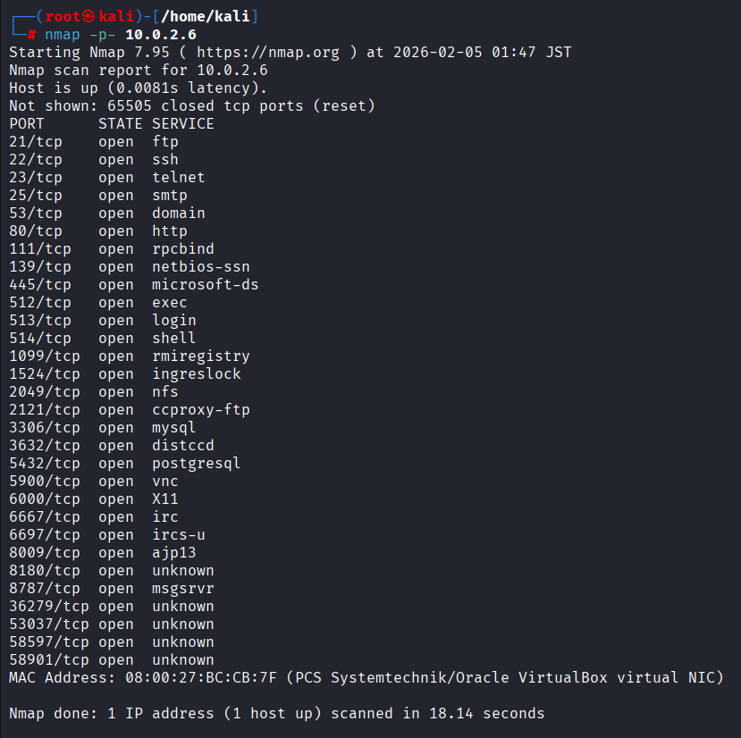
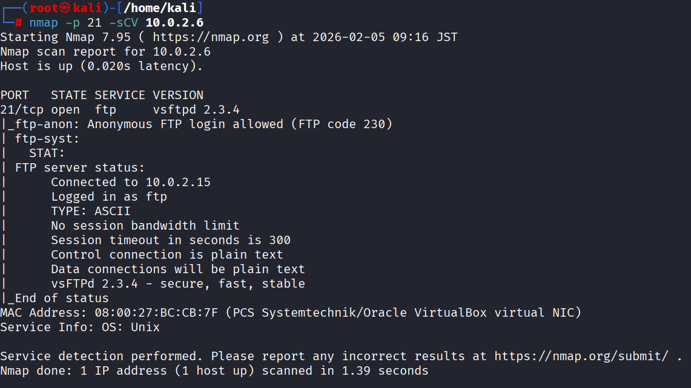
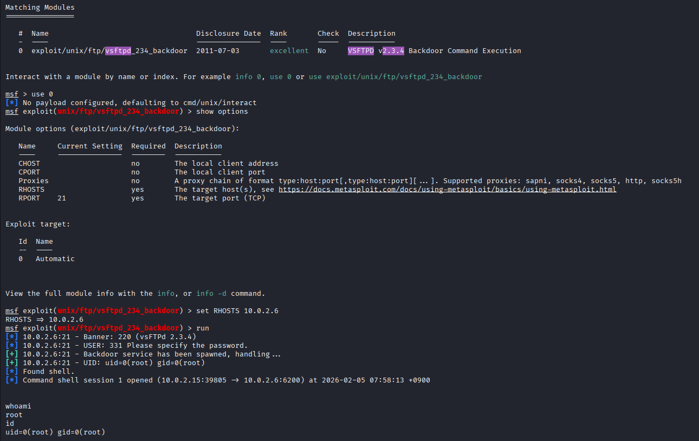
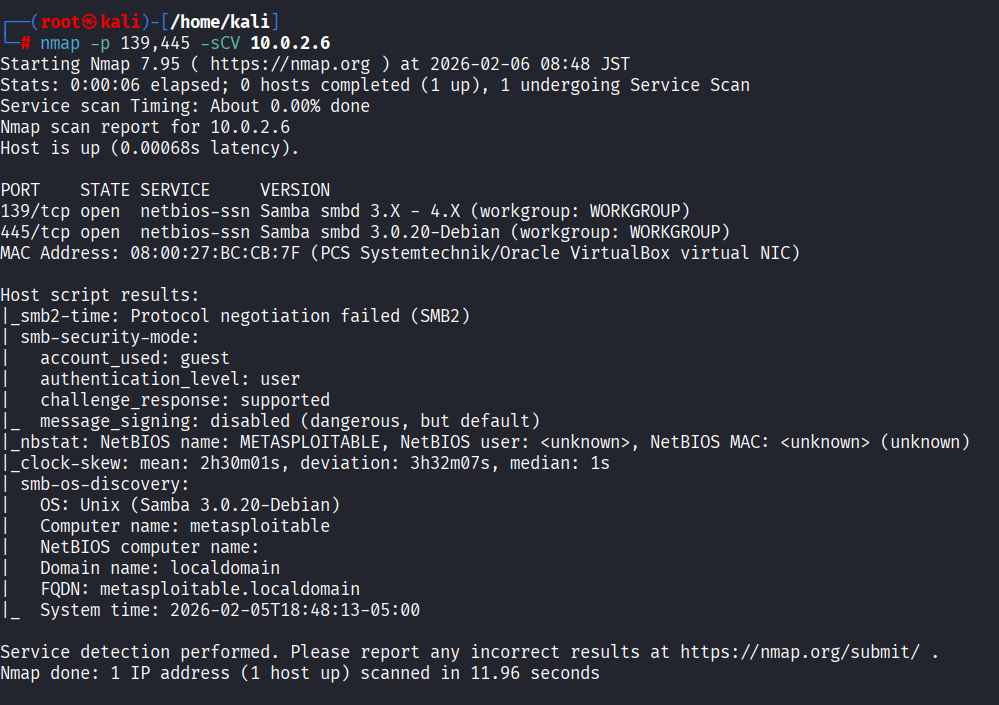
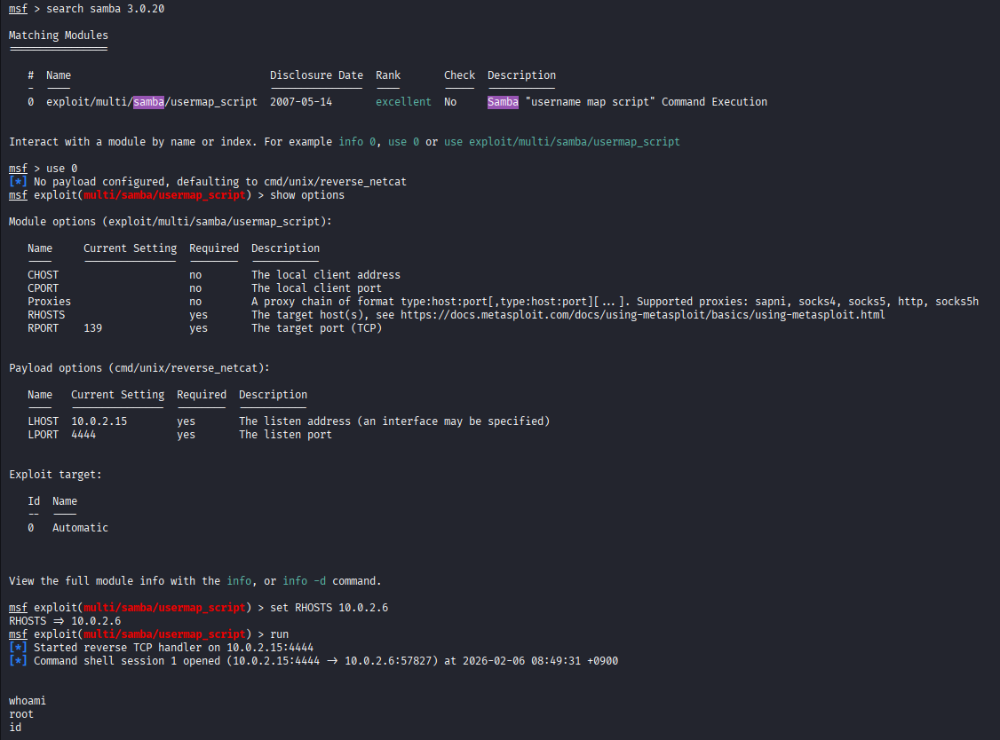

# Metasploitable 2 - Security Assessment 

## Información del objetivo

- **IP:** 10.0.2.6
- **Sistema Operativo:** Linux 2.6.9 - 2.6.33
- **Propósito:** Análisis de vulnerabilidades en entorno controlado


## Metodología
1. Reconocimiento y escaneo de red
2. Enumeración de servicios
3. Identificación de vulnerabilidades
4. Explotación
5. Documentación y remediaciones


## Reconocimiento inicial 

### Escaneo de puertos

Se realizó un escaneo para identificar todos los puertos abiertos:

```bash
nmap -p- 10.0.2.6
```



## Análisis de resultado
Se encontraron más de 15 puertos con servicios expuestos. Para verificar si son explotables, el siguiente paso es hacer un escaneo de **detección de servicios** para conocer que software específico está corriendo y si existen vulnerabilidades conocidas de dichas versiones.


### Puerto 21 - FTP (vsftpd 2.3.4)

```bash
nmap -p 21 -sCV
```




A partir del escaneo de versiones, se identificó un backdoor en este servicio.

* **Vulnerabilidad:** Backdoor Command Execution (CVE-2011-2523)
* **Módulo utilizado `exploit/unix/ftp/vsftpd_234_backdoor`
* **Impacto:** Acceso a root al sistema.
* **Remediación:** Se recomienda actualizar el servidor FTP, o usar servicios más seguros como SFTP. Además, se debe restringir el acceso a el puerto 21 por medio de un Firewall si no es necesario.




> **Nota:** Como se observa en la captura, tras correr el exploit permitea acceso a root al sistema.


### Puerto 139 / 445 - NetBIOS / Samba

```bash
nmap -p 139,445 -sCV 10.0.2.6
```


* **Servicio:** Samba 3.0.20-Debian.
* **Vulnerabilidad:** usermap_script (Ejecución remota de comandos -RCE).
* **Análisis:** Se utiliza un módulo de Metasploit para explotar una deficiencia en el manejo de nombres de usuario, esto permite inyectar una shell en el servidor.
* **Impacto:** Crítico. Se obtiene una shell con privilegios de root de forma directa, permite control total del sistema.
* **Remediación:** Actualización de software a una superior, limitar los accesos al puerto 139 y 445 por medio de firewall, permitiendo solamente IP confiables.




### Análisis de servicios adicionales

### Puerto 22 - (SSH)
* **Servicio:** OpenSSH 4.7p1
* **Vulnerabilidad:** Uso de credenciales débiles y suceptible a ataques de fuerza bruta.

### Puerto 23 (Telnet)
* **Servcio:** Linux telnetd.
* **Vulnerabilidad:** Protocolo inseguro, las credenciales viajan por texto plano.
* **Riesgo:** Se puede sniffear el tráfico y obtener contraseñas.


