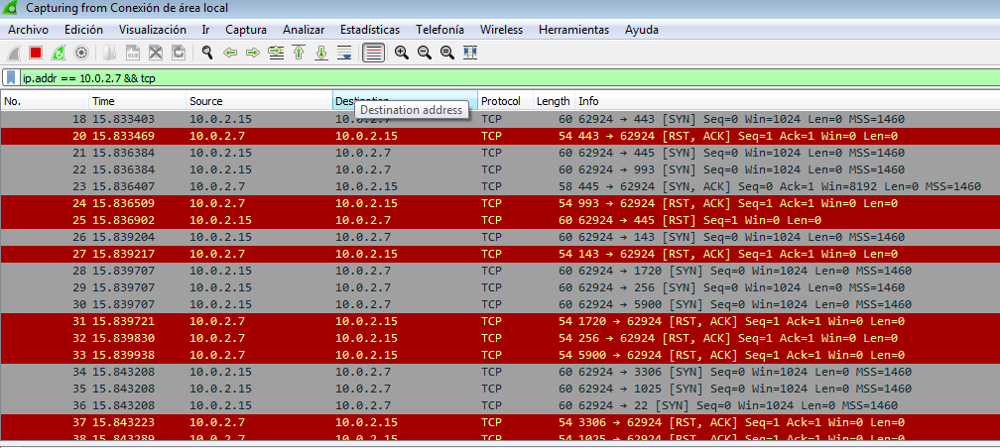
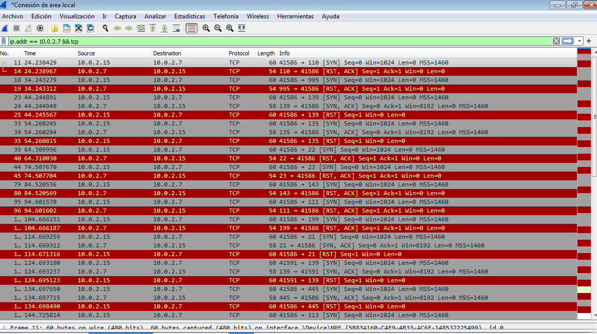

# Escaneo Agresivo vs Silencioso: Análisis desde la máquina atacada

**Objetivo** 
Analizar y comparar el tráfico que llega a la máquina de la víctima utilizando *Nmap* de forma agresiva, y otra silenciosa. 

**Entorno**
Atacante: Kali Linux (IP: 10.0.2.15)
Víctima: Windws 7 vulnerable (IP 10.0.2.7)
Herramientas: Nmap (En Kali Linux) Y Wireshark (Windows 7)

**Metodología** 
1. Se inició captura con Wireshark en la máquina con Windows 7.
2. Se filtra la captura con `ip.addr == 10.0.2.7 && tcp`.
3. Se ejecutaron dos escaneos desde Kali: Uno agresivo, y otro más silencioso.
4. Se tomaron capturas de ambos por separado.


### Escaneo agresivo:

Comando ejecutado desde Kali:
```bash
nmap -sV -A -T4 -p- 10.0.2.7
```



## Análisis de la captura:

* En esta captura se puede observar que los paquetes llegan con una diferencia de milisegundos, llegando a mas de 20 por segundo.
* El escaneo con -T4 y -A envía muchos paquetes SYN que son detectables por cualquier IDS/IPS al ser tan ruidoso.
* Resultado: Se prioriza obtener versiones y servicios, pero se detecta rápido.


### Escaneo silencioso:

Comando ejecutado desde Kali:
```bash
nmap -sS -T0 --scan-delay 10000ms --max-rate 50 -p 1-1000 10.0.2.7
```



## Análisis de la captura:

* Se puede ver que de esta forma los paquetes llegan con una frecuencia de 1 cada 10 segundos.
* Al usar -T0 se busca que se mezcle con el tráfico habitual de la red, intentando evadir los sistemas de monitoreo.
* Al reducir los paquetes enviados por segundo se pierde tiempo (Podría tomar horas obtener todos los puertos).
